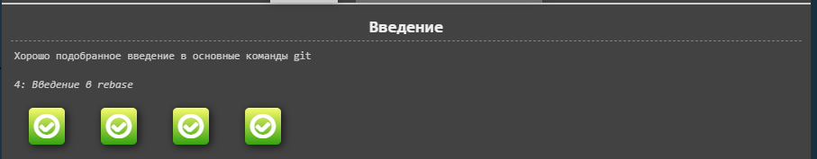
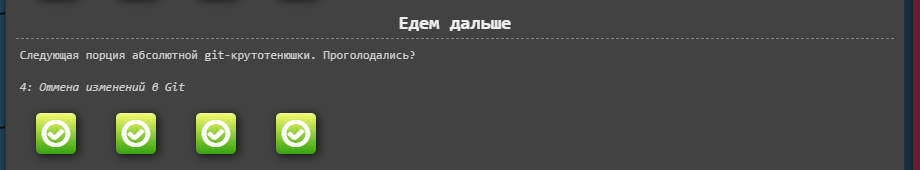
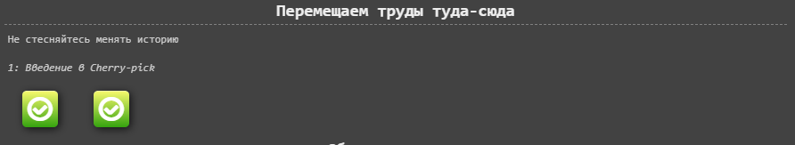
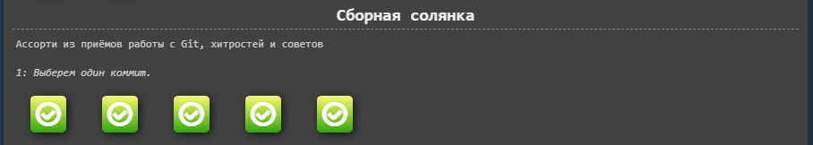
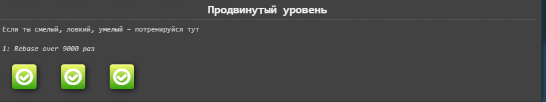
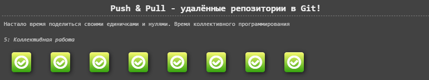
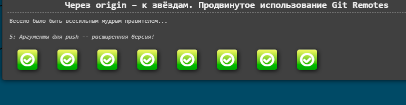
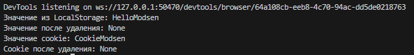

# MODSEN_Courses

[Go back](../README.md)

The course objectives and my solutions are summarized here

# HTTP

Task: get all HTTP response statuses

## A brief summary of the statuses that can be obtained using HTTP requests:

1.  Informational responses (100 - 199)
2.  Successful responses (200 - 299)
3.  Redirection messages (300 - 399)
4.  Customer Errors (400 - 499)
5.  Server errors (500 - 599)

## APIs used:

1. https://reqres.in/api
2. https://jsonplaceholder.typicode.com

## Solution:

```plaintext
Successful Response - 200
Successful Response - 201
Redirect Response - 301
ErrorClient Response - 400
ErrorClient Response - 404
```

## Why couldn't get 100th and 500th answer statuses

1xx responses (100th codes):

- Intended for information exchange: 100th status codes are used for intermediate informational responses. The most commonly used code is 100 (Continue), which tells the client that the server has received the initial portion of the request and the client can continue sending the remainder.
- Rarely used in real life: Although these codes exist, they are rarely used.
  Clients and servers mostly work with codes 200 and above. For example, code 101 (Switching Protocols) is used for protocol switching,
  which is also uncommon.
- Automatic management: Most modern HTTP libraries and frameworks automatically manage intermediate 1xx responses.
  intermediate 1xx responses, so client applications rarely see these codes directly.

Answers 5xx (500s codes):

- Server errors: 500th status codes indicate that an error has occurred on the server that is preventing the request from executing. For example,
  500 (Internal Server Error) code indicates a general problem on the server side.
- Assumes stable server operation: Under normal circumstances, servers are configured and tested for stable operation,
  minimizing the occurrence of errors. Administrators and developers take steps to prevent failures.
- Error handling: Modern server systems often have mechanisms for handling and logging errors,
  and to return friendlier error messages to clients, which can hide the original 500s.
  Examples:
  100 (Continue): The client is sending a request with a large data load and is waiting for confirmation from the server that it is okay to continue sending.
  500 (Internal Server Error): The server cannot process the request due to an internal error, such as a code or database failure.
  Thus, in normal situations, codes 100 and 500 are less common due to the specificity of their application and measures to prevent server errors.

# Git

Task: go through the application https://learngitbranching.js.org/

## Solution:

### Main:

### 1.1:

- 1: Introduction to Git Commits

```plaintext
git commit
git commit
```

- 2: Branching in Git

```plaintext
git branch bugFix
git checkout bugFix
```

- 3: Merging in Git

```plaintext
git branch bugFix
git checkout bugFix
git commit
git checkout main
git commit
git merge bugFix
```

- 4: Rebase Introduction

```plaintext
git branch bugFix
git checkout bugFix
git commit
git checkout main
git commit
git checkout bugFix
git rebase main
```



### 1.2:

- 1: Detach yo' HEAD

```plaintext
git checkout C4
```

- 2: Relative Refs (^)

```plaintext
git checkout bugFix^
```

- 3: Relative Refs #2 (~)

```plaintext
git checkout C1
git branch -f main C6
git branch -f bugFix bugFix~3
```

- 4: Reversing Changes in Git

```plaintext
git reset HEAD~1
git checkout pushed
git revert HEAD
```



### 1.3:

- 1: Cherry-pick Intro

```plaintext
git cherry-pick C3 C4 C7
```

- 2: Interactive Rebase Intro

```plaintext
git rebase -i HEAD~4
```



### 1.4:

- 1: Grabbing Just 1 Commit

```plaintext
git checkout main
git cherry-pick C4
```

- 2: Juggling Commits

```plaintext
git rebase -i main
git commit --amend
git rebase -i main
git branch -f main caption
```

- 3: Juggling Commits #2

```plaintext
git checkout main
git cherry-pick C2
git commit --amend
git cherry-pick caption
```

- 4: Git Tags

```plaintext
git checkout C2
git tag v1 C2
git tag v0 C1
```

- 5: Git Describe

```plaintext
  git describe main
  git describe side
  git describe bugFix
  git commit
```



### 1.5:

- 1: Rebasing over 9000 times

```plaintext
git rebase main bugFix
git rebase bugFix side
git rebase side another
git rebase another main
```

- 2: Multiple parents

```plaintext
git branch bugWork HEAD~^2~
```

- 3: Branch Spaghetti

```plaintext
git checkout one
git cherry-pick C4 C3 C2
git checkout two
git cherry-pick C5 C4 C3 C2
git branch -f three C2
```



### Remote:

### 2.1:

- 1: Clone Intro

```plaintext
git clone
```

- 2: Remote Branches

```plaintext
git commit
git checkout o/main
git commit
```

- 3: Git Fetchin'

```plaintext
git fetch
```

- 4: Git Pullin'

```plaintext
git pull
```

- 5: Faking Teamwork

```plaintext
git clone
git fakeTeamwork main 2
git commit
git pull
```

- 6: Git Pushin'

```plaintext
git commit
git commit
git push
```

- 7: Diverged History

```plaintext
git clone
git fakeTeamwork
git commit
git pull --rebase
git push
```

- 8: Locked Main

```plaintext
git reset --hard o/main
git checkout -b feature C2
git push origin feature
```



#### 2.2:

- 1: Push Main!

```plaintext
git rebase side1 side2
git rebase side2 side3
git rebase side3 main
git pull --rebase
git push
```

- 2: Merging with remotes

```plaintext
git checkout main
git pull
git merge side1
git merge side2
git merge side3
git push
```

- 3: Remote Tracking

```plaintext
git checkout -b side o/main
git commit -m "My commit"
git pull --rebase
git push
```

- 4: Git push arguments

```plaintext
git push origin main
git push origin foo
```

- 5: Git push arguments -- Expanded!

```plaintext
git push origin main~1:foo
git push origin foo:main
```

- 6: Fetch arguments

```plaintext
git fetch origin c6:main
git fetch origin c3:foo
git checkout foo
git merge main
```

- 7: Source of nothing

```plaintext
git push origin :foo
git fetch origin :bar
```

- 8: Pull arguments

```plaintext
git pull origin c3:foo
git pull origin c2:side
```



# Internet

Task:

- open a web page, set the value to LocalStorage, then retrieve that value and then delete it.
- open a web page, set a value in a cookie, then retrieve that value, and then delete it

## Solution:


